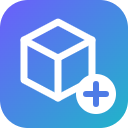
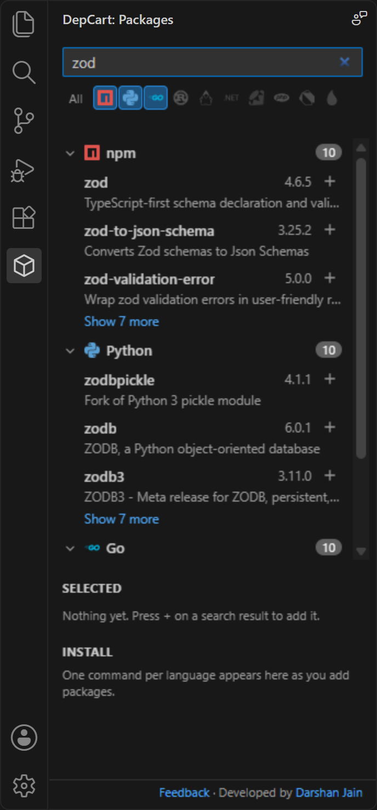
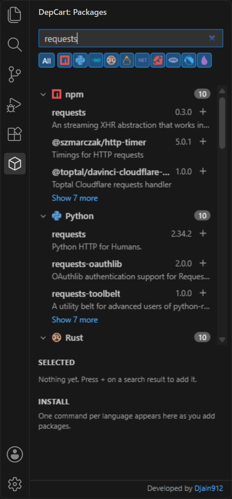
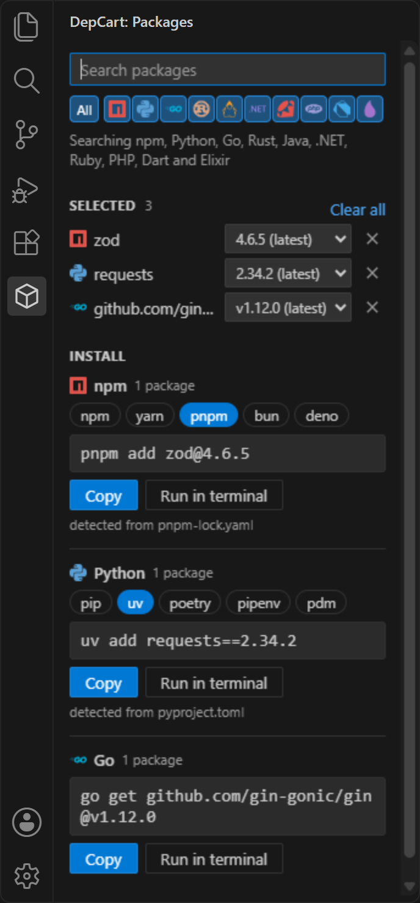

<p align="center">
  
</p>

<h1 align="center">DepCart</h1>

<p align="center">
  <b>Search 10 package registries from one VS Code sidebar. Pick exact versions. Get one install command per language.</b>
</p>

<p align="center">
  <a href="https://marketplace.visualstudio.com/items?itemName=djain912.depcart"></a>
  <a href="https://marketplace.visualstudio.com/items?itemName=djain912.depcart"></a>
  <a href="https://github.com/Djain912/depcart/releases/latest"></a>
  <a href="https://github.com/Djain912/depcart/actions/workflows/ci.yml"></a>
  <a href="LICENSE"></a>
  
  <a href="https://linkedin.com/in/darshanjain912"></a>
</p>

<p align="center">
  <a href="https://djain912.github.io/depcart/"><b>Website</b></a> ·
  <a href="https://github.com/Djain912/depcart/releases/latest"><b>Download the .vsix</b></a> ·
  <a href="https://marketplace.visualstudio.com/items?itemName=djain912.depcart"><b>VS Code Marketplace</b></a>
</p>

https://github.com/user-attachments/assets/41a385e9-c85a-4d75-a9ed-5b72cbe4eca4

---

Adding dependencies usually means a browser tab per registry: npmjs.com for the frontend, pypi.org for the scripts, pkg.go.dev for the service, then working out whether this project uses npm or pnpm, pip or uv. **DepCart puts all of that in your editor.** Search once, add what you need from any language, choose versions, and copy or run the exact command your project's tools expect.

## Features

- **Ten registries, one search box.** npm, PyPI, Go modules, crates.io, Maven Central, NuGet, RubyGems, Packagist, pub.dev and Hex. Toggle languages with one click; the ones your project uses are switched on automatically.
- **Clean, grouped results.** Results are grouped by language with registry logos, the top 3 per group, and "Show more" when you want the rest. Exact name matches rise to the top.
- **Every version, not just the latest.** Pick any published version from a dropdown; stable releases come first so hundreds of nightly builds don't bury them.
- **One command per language, never mixed.** npm packages and Go modules end up in separate commands, each ready to copy or run.
- **Every install tool a language offers.** Switch with one click, and DepCart remembers your choice per project.
- **Knows your project.** `pnpm-lock.yaml` means pnpm, `uv.lock` means uv, `[tool.poetry]` means poetry, a Flutter `pubspec.yaml` means `flutter pub add`, and so on.
- **Open any package's page.** Click a name to open it on the official registry website.
- **Run it for you.** "Run in terminal" opens a terminal in your project folder and runs the command.
- **Search that keeps working.** If a registry's own search is slow, down or finds nothing, DepCart falls back to the [ecosyste.ms](https://ecosyste.ms) package index. Optional AI suggestions (through VS Code's language model API, for example GitHub Copilot) help when nothing matches, and every suggestion is checked against the real registry before you see it.
- **Safe by design.** Package names and versions are validated before they reach a command, so a malicious package name can't inject shell syntax or extra flags.

## Screenshots

| Search | All languages | Install |
|:---:|:---:|:---:|
|  |  |  |

## Supported registries and tools

| Language | Registry | Install tools |
|---|---|---|
| JavaScript / TypeScript | npm | `npm install`, `yarn add`, `pnpm add`, `bun add`, `deno add` |
| Python | PyPI | `pip install`, `uv add`, `poetry add`, `pipenv install`, `pdm add` |
| Go | Go module proxy | `go get` |
| Rust | crates.io | `cargo add` |
| Java / Kotlin | Maven Central | Maven `<dependency>`, Gradle Kotlin, Gradle Groovy (build-file snippets) |
| .NET | NuGet | `dotnet add package`, `paket add`, `<PackageReference>` snippet |
| Ruby | RubyGems | `gem install`, `bundle add` |
| PHP | Packagist | `composer require` |
| Dart / Flutter | pub.dev | `dart pub add`, `flutter pub add` |
| Elixir | Hex | `mix.exs` deps snippet |

## Install

- **VS Code Marketplace:** search for **DepCart** in the Extensions view, or open [the Marketplace page](https://marketplace.visualstudio.com/items?itemName=djain912.depcart).
- **From a .vsix:** download `depcart-<version>.vsix` from the [latest release](https://github.com/Djain912/depcart/releases/latest) (or the [website](https://djain912.github.io/depcart/)), then in VS Code open the Extensions view, click **...** and choose **Install from VSIX...**, or run:

  ```bash
  code --install-extension depcart-0.0.1.vsix
  ```

## How to use

1. Click the **DepCart** icon in the Activity Bar.
2. Type a package name (or part of one). Use the logo toggles to choose which languages to search.
3. Press **+** next to each package you want. Click a name to check its page first.
4. Under **Selected**, pick a version for each package (the latest release is chosen for you).
5. Under **Install**, pick the tool if you need a different one, then **Copy** or **Run in terminal**.

### How the install tool is chosen

DepCart looks at the top level of your workspace folder:

| Found | Tool |
|---|---|
| `package-lock.json` / `yarn.lock` / `pnpm-lock.yaml` / `bun.lock` / `deno.json`, or `"packageManager"` in `package.json` | npm / yarn / pnpm / bun / deno |
| `uv.lock` or `[tool.uv]`, `poetry.lock` or `[tool.poetry]`, `Pipfile`, `pdm.lock` or `[tool.pdm]` | uv, poetry, pipenv, pdm (otherwise pip) |
| `Gemfile` | bundler (otherwise gem) |
| `paket.dependencies` | Paket (otherwise dotnet CLI) |
| `pom.xml`, `build.gradle.kts`, `build.gradle` | Maven, Gradle Kotlin, Gradle Groovy |
| `pubspec.yaml` with `sdk: flutter` | flutter (otherwise dart) |

Pick a different tool in the Install section at any time; DepCart remembers it for that workspace.

## Privacy and network use

DepCart has no servers of its own and collects no telemetry.

- **Search text** goes to the registries you have switched on (npm, PyPI, pkg.go.dev and the Go module proxy, crates.io, Maven Central, NuGet, RubyGems, Packagist, pub.dev, Hex) and to [packages.ecosyste.ms](https://packages.ecosyste.ms), the backup search index.
- **AI suggestions** (only when the registries find nothing, or when you click "Ask AI") send your search text to the language model you use in VS Code, such as GitHub Copilot. VS Code asks for your permission the first time. Turn it off with the `depcart.aiFallback` setting.
- **Python fallback search** may download PyPI's official list of project names once (about 10 MB) and cache it for 7 days in VS Code's extension storage.
- **Your project files never leave your machine.** DepCart only reads the names and a few config files at the top of your workspace folder to detect languages and tools.
- Requests identify themselves as `depcart-vscode (+https://github.com/Djain912/depcart)`, as the registries' usage policies ask.

## Settings

| Setting | Default | Description |
|---|---|---|
| `depcart.aiFallback` | `true` | Ask VS Code's language model for package names when registry search finds nothing. Suggestions are only shown if they exist on the registry, and are marked **AI**. |

## Requirements

- VS Code 1.90 or newer.
- A trusted workspace folder (DepCart is disabled in Restricted Mode because it can run install commands).
- The package manager you choose must be installed for "Run in terminal" to work (for example `pnpm` or `uv`).
- AI suggestions need a language model extension, such as GitHub Copilot Chat, signed in.

## Known limitations

- Public registries only. Private registries, `.npmrc` / pip index URLs, proxies and Artifactory aren't supported yet.
- Tool detection and "Run in terminal" use the workspace folder's root, not subfolders of a monorepo.
- No dev-dependency option yet (`-D`, `--group dev`).
- Maven, Gradle and Mix have no "add dependency" command, so those languages get a snippet to paste into your build file.
- `cargo add serde@1.0.200` uses Cargo's default (compatible-version) requirement, so Cargo may pick a newer 1.0.x.

Ideas and bug reports are welcome in [Issues](https://github.com/Djain912/depcart/issues).

## Development

```bash
npm install
npm test            # unit tests
npm run test:host   # runs the extension inside a real VS Code against the live registries
npm run package     # builds the .vsix
```

Press **F5** in VS Code to launch an Extension Development Host with DepCart loaded.

## Developer

DepCart is built by **Djain912**: [LinkedIn](https://linkedin.com/in/darshanjain912) · [GitHub](https://github.com/Djain912). You'll also find a small "Developed by" link at the bottom of the DepCart sidebar.

## Credits

- Registry logos from [Simple Icons](https://simpleicons.org) (CC0). Names and logos belong to their owners and are used only to identify each ecosystem.
- Backup search by [ecosyste.ms](https://ecosyste.ms).

## License

[MIT](LICENSE)
